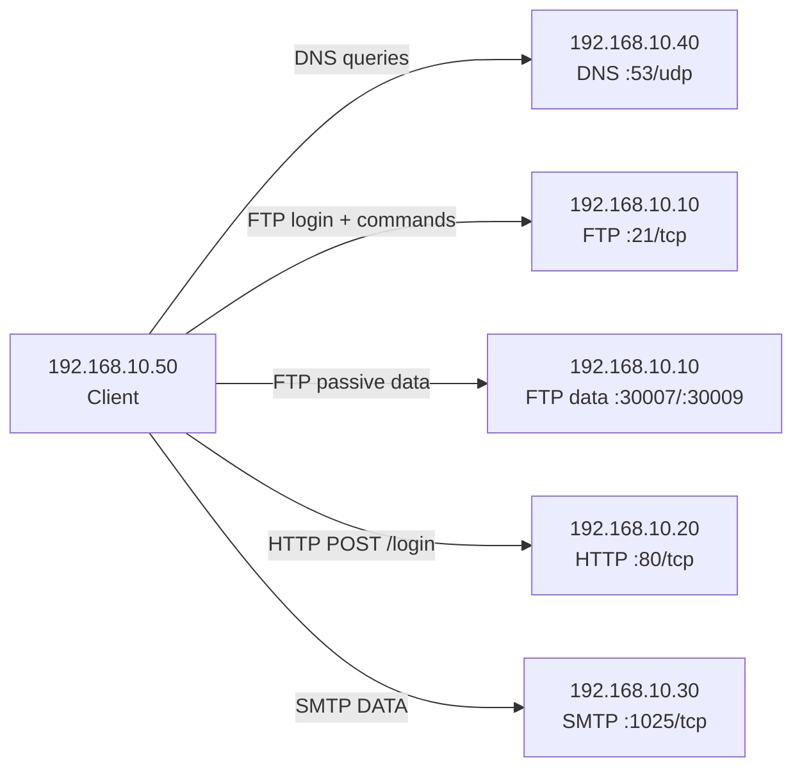

# 🟥 Red-Team Report — Sniff Docker Network Traffic (Credentials)

**Target file:** `red-team/docs/sniff-docker-traffic.md`  
**Evidence PCAP:** `red-team-wireshark-dump.pcapng`  
**Timezone:** Europe/Zurich (CET)

---

## 📌 Objective

Capture and analyze **unencrypted Docker lab traffic** to identify:

- insecure protocols (FTP / HTTP / SMTP / DNS)
- leaked credentials and sensitive content
- host ↔ service relationships
- communication patterns that enable **pre-attack reconnaissance**

This is written for an educational forensic lab. It documents outcomes and observations, not exploitation.

---

## 🧾 Capture Evidence (PCAP Metadata)

- **Frames:** 1312
- **Capture window:** 2026-01-25 11:05:41.336695 CET → 2026-01-25 11:05:47.021998 CET (**5.685s**)
- **Timestamp resolution:** 1e-09 seconds (nanosecond scale)
- **Link type:** Ethernet (pcapng interface linktype 1)

> Deliverable note: The PCAP is the primary evidence. Screenshots referenced below should be taken directly from Wireshark views that show the cited frame(s).

---

## 1️⃣ Capture Method (How Traffic Was Sniffed)

**Host-based capture approach (lab-safe):**
- Network traffic was captured at the **Docker network interface** that carries container traffic (bridge / NAT interface depending on platform).
- The capture was started **before** running the lab traffic generator (`generate-traffic.sh`) and stopped immediately after.
- Output was saved as a **PCAP/PCAPNG** file (this submission: `red-team-wireshark-dump.pcapng`).

**Analysis approach:**
- Traffic was reviewed using protocol-level display filters (e.g., `ftp`, `http`, `smtp`, `dns`) and connection-scoped views (e.g., *Follow TCP Stream*).
- Findings were validated by referencing the exact **frame numbers** where the sensitive content appears.

*(This section intentionally avoids real-world “how to sniff others” advice; it documents a controlled lab capture.)*

---

## 2️⃣ Sensitive Data Extraction (What Leaked in Cleartext)

### 🔴 FTP — Plaintext USER/PASS Credentials

**Connection (control channel):**
- `192.168.10.50:41490` → `192.168.10.10:21`
- Service banner indicates **Pure-FTPd** with TLS capability

**What was exposed:**
- Username and password were visible as ASCII commands on the control channel:
  - `USER te*****r` *(masked)*
  - `PASS te*****s` *(masked)*

**Evidence (PCAP):**
- **Frame 552** — FTP banner: `Pure-FTPd … [TLS]`
- **Frame 559** — `USER te*****r`
- **Frame 561** — `PASS te*****s`
- **Frame 556** — server advertises `AUTH TLS` (encryption available but **not used**)

**Additional intelligence (FTP data exposure):**
FTP passive mode opened **server-side data ports** that reveal firewall exposure and data movement:
- **STOR upload.txt** (upload intent): **Frame 574**
  - Data connection observed on `192.168.10.10:30007` (FTP passive port)
  - **Frame 576** contains uploaded content (plaintext): `forensic ftp upload 2026-01-25T10:05:44Z`
- **LIST** (directory listing intent): **Frame 592**
  - Data connection observed on `192.168.10.10:30009`
  - **Frame 595** contains a directory listing showing `upload.txt`

**Why this matters (attacker view):**
- Credentials can be reused instantly to authenticate to FTP.
- Passive data ports expand the externally reachable surface if firewall rules are permissive.
- Filenames and directory listings leak operational context.

---

### 🔴 HTTP — Plaintext Login POST Parameters

**Connection:**
- `192.168.10.50:40994` → `192.168.10.20:80`

**What was exposed:**
- An HTTP `POST /login` contained form fields in cleartext:
  - `user=t**t&pass=1**4` *(masked)*

**Evidence (PCAP):**
- **Frame 611** — `POST /login HTTP/1.1` with `application/x-www-form-urlencoded` body including `user=` and `pass=`
- **Frame 612** — server response fingerprints `Server: nginx/1.29.4` (useful for attacker recon)

**Why this matters (attacker view):**
- Capturing a single login attempt yields reusable credentials.
- HTTP headers reveal server software and version, helping attackers tailor vulnerability research.

---

### 🔴 SMTP — Plaintext Email Content (Header + Body)

**Connection:**
- `192.168.10.50:54964` → `192.168.10.30:1025`

**What was exposed:**
- Email sender/recipient metadata
- Subject header
- Full email body content

**Evidence (PCAP):**
- **Frame 621** — SMTP transaction containing:
  - `MAIL FROM:<al**********ic.local>` *(masked)*
  - `RCPT TO:<bo********ic.local>` *(masked)*
  - `Subject: Forensic SMTP Test`
  - Body: `Hello from plaintext SMTP for packet capture demo.`
- **Frame 623** — server banner: `220 … MailHog`
- **Frame 629** — server advertises `AUTH PLAIN` (high risk if used without encryption)

**Accuracy note (important for grading):**
- The server advertises AUTH capability, but **no SMTP AUTH credential exchange** appears in this PCAP.
- The exposure here is primarily **message content** and metadata.

**Why this matters (attacker view):**
- Email content can contain internal info, reset links/tokens, or private communications.
- Address harvesting supports targeted social engineering.

---

### 🟡 DNS — Query Intelligence (Domains, Metadata)

**Connection:**
- `192.168.10.50` ↔ `192.168.10.40:53/udp`

**What was exposed:**
- Queried domains (both external and internal service names)
- Internal naming conventions and service discovery mapping

**Evidence (PCAP):**
- **Frames 644–645** — `google.com` A-record lookup + multi-IP answer set
- **Frames 646–647** — `ftp.lab.local` → **192.168.10.10**
- **Frames 649–650** — `smtp.lab.local` → **192.168.10.30**

**Why this matters (attacker view):**
- Internal domains reveal environment structure and target naming.
- DNS answers identify service hosts without scanning.

---

## 3️⃣ Attacker Intelligence Profile (Pre-Attack Recon Output)

### Hosts → Services → Weaknesses (from this PCAP)

| Host/IP | Service | Ports | Observed weakness / intel | Evidence (PCAP) |
| --- | --- | --- | --- | --- |
| 192.168.10.40 | DNS | 53/udp | Answers for internal names; reveals org naming; plaintext metadata | Frames 644–650 |
| 192.168.10.10 | FTP (Pure-FTPd) | 21/tcp + passive data ports (30007, 30009) | Plaintext USER/PASS; TLS capability advertised but not enforced | Frames 552, 559, 561, 574, 592; data in 576, 595 |
| 192.168.10.20 | HTTP (nginx/1.29.4) | 80/tcp | Plaintext login POST parameters; server fingerprinting | Frames 611–612 |
| 192.168.10.30 | SMTP (MailHog) | 1025/tcp | Plaintext email metadata + content; AUTH PLAIN advertised (risk if used without TLS) | Frames 621–631 |
| 192.168.10.50 | Client / Traffic Generator | ephemeral | Origin of credentials and requests (source of sensitive data) | Multiple |

### Communication pattern map

### What an attacker learns before exploitation (confirmed from PCAP)

- **Valid credentials** for at least two services (FTP + HTTP) were transmitted in plaintext.
- **Internal service discovery** is possible from DNS alone (`ftp.lab.local`, `smtp.lab.local`).
- **Service fingerprinting** is trivial (Pure-FTPd, nginx version, MailHog banner).
- **Data movement paths** are visible:
  - FTP control (21/tcp) + passive data ports (30007, 30009)
  - HTTP login endpoint behavior (`/login`)
  - SMTP message flow and recipient addresses

### Potential lateral movement paths (high-level, defensive framing)

- Reused credentials across FTP/HTTP could enable broader access if credential hygiene is weak.
- FTP file read/write access may amplify impact if those files are consumed by other internal workflows.
- Email metadata and content supports highly targeted social engineering inside the environment.
- DNS naming intel reduces attacker time-to-target and identifies high-value services early.

---

## 📸 Required Screenshots (Wireshark Evidence Pack)

Take screenshots that clearly show the cited frames and decoded fields:

1. **FTP credentials in plaintext**
   - Show **Frame 559** (`USER …`) and **Frame 561** (`PASS …`)
2. **FTP passive data leakage**
   - Show **Frame 576** (uploaded content) and **Frame 595** (directory listing output)
3. **HTTP login POST body**
   - Show **Frame 611** with `user=` and `pass=` parameters visible
   - Optional: **Frame 612** showing `Server: nginx/1.29.4`
4. **SMTP message content**
   - Show **Frame 621** (MAIL FROM / RCPT TO / Subject / body)
   - Show **Frame 629** (`AUTH PLAIN` advertised)
5. **DNS intelligence**
   - Show **Frames 646–647** (`ftp.lab.local` → 192.168.10.10)
   - Show **Frames 649–650** (`smtp.lab.local` → 192.168.10.30)

